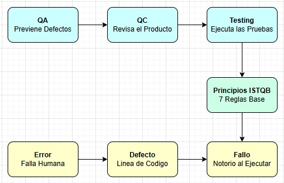

# Mapa Conceptual

## Los 7 principios ISTQB 
1. El testing muestra que hay bugs, no que no hay
2. Es imposible probar el 100% de los casos posibles
3. Probar temprano en el desarrollo sale más barato que corregir al final
4. Los bugs tienden a agruparse en ciertos módulos no distribuirse parejo
5. Repetir las mismas pruebas deja de encontrar bugs nuevos
6. Las pruebas dependen del tipo de sistema que se está probando
7. Que no se encuentren bugs no significa que el sistema resuelva lo que el usuario necesita

## Relacion de lo aprendido
QA diseña el proceso para que los defectos ocurran menos QC lo inspecciona ya construido Testing es la ejecución concreta dentro de QC guiada por los 7 principios ISTQB. Cuando Testing detecta un comportamiento inesperado eso es un Fallo que se rastrea hasta el Defecto en el código originado por un Error humano
