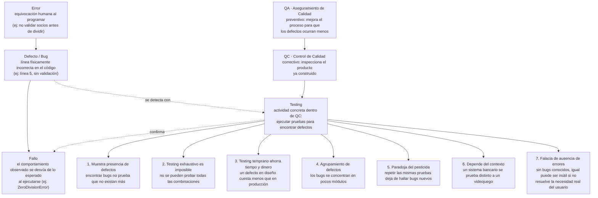

# Casos de Prueba — Sistema de Análisis de Presupuesto

## Actividad 1 · Mapa Conceptual

Conecta los tres bloques pedidos: **Roles operativos** (QA vs. QC vs. Testing), **los 7
principios de ISTQB** (síntesis propia) y la cadena **Error → Defecto → Fallo**.



**Lectura del mapa:** un *Error* humano (no pensar en el caso límite) deja un *Defecto*
físico en una línea de código; ese defecto se queda dormido hasta que el *Testing* —la
actividad concreta dentro del *QC*, que a su vez es la fase correctiva del *QA*— lo
ejecuta con la entrada correcta y lo convierte en un *Fallo* observable. Los 7 principios
de ISTQB explican por qué ese proceso de testing nunca es perfecto ni exhaustivo, y por
qué depende de dónde se aplique.

---

## Actividad 3 y 4 · Tabla de Casos de Prueba (Caja Negra → Caja Blanca)

Diseño de caja negra (partición de equivalencia + valores límite sobre `presupuesto`,
`socios` y `meses`), ejecutado y diagnosticado con el código abierto.

| ID | Descripción | Precondición | Entrada | Esperado | Real | Estado |
|----|---|---|---|---|---|---|
| CP-01 | Presupuesto negativo (partición inválida de `presupuesto`) | Sistema iniciado | `presupuesto=-1000`, `socios=2`, `meses=3` | Mensaje controlado de error / rechazo del valor, sin calcular resultados sin sentido | Acepta el valor y calcula en silencio: `Presupuesto inicial: $-1000.00`, `Cuota por socio: $-590.00` | **Failed** |
| CP-02 | Número de socios en el valor límite cero | Sistema iniciado, `presupuesto>0` | `presupuesto=1000`, `socios=0`, `meses=3` | Mensaje controlado de error, sin cerrar el programa | `ZeroDivisionError: division by zero` — el programa se detiene abruptamente | **Failed** |
| CP-03 | Cálculo de intereses con valor límite bajo de `meses` (2) | Sistema iniciado, datos válidos | `presupuesto=1000`, `socios=2`, `meses=2` | `$40.00` de intereses (modelo de interés simple: `presupuesto × tasa × meses` = `1000 × 0.02 × 2`) | `$80.00` de intereses (el programa calculó `1000 × 0.02 × 2²`) | **Failed** |

### Diagnóstico (Caja Blanca)

**CP-01 — Defecto en línea 4:**
```python
presupuesto = float(input("Ingrese el presupuesto total: "))
```
No existe ninguna validación de que `presupuesto` sea un valor positivo. El Fallo (resultados
financieros negativos sin aviso) se manifiesta más abajo en los `print`, pero el Defecto —la
ausencia del chequeo— está en esta línea, donde el dato entra al sistema sin control.

**CP-02 — Defecto en línea 5, manifestado en línea 13:**
```python
socios = int(input("Ingrese el número de socios: "))   # línea 5, defecto: falta validar socios >= 1
...
cuota_por_socio = total / socios                        # línea 13, aquí se dispara el Fallo
```
El Error humano fue no anticipar que `socios` pudiera ser cero. El Defecto es la falta de
validación en la línea 5; el Fallo (`ZeroDivisionError`) solo aparece cuando la línea 13 se
ejecuta con ese valor límite.

**CP-03 — Defecto en línea 10:**
```python
intereses = presupuesto * tasa_interes_mensual * (meses ** 2)   # ← línea defectuosa
```
La fórmula eleva `meses` al cuadrado en vez de usarlo linealmente. Para un modelo de interés
simple mensual, el interés debería crecer proporcional al tiempo (`× meses`), no de forma
cuadrática (`× meses²`). Este defecto no rompe el programa —es silencioso— y solo se detecta
comparando el resultado real contra el valor calculado manualmente.

---

**Reporte de defectos — resumen:**

| Defecto | Línea | Tipo | Causa raíz |
|---|---|---|---|
| D1 | 4 | Validación de entrada | No se rechaza `presupuesto < 0` |
| D2 | 5 (dispara en 13) | Validación de entrada / crash | No se rechaza `socios <= 0` antes de dividir |
| D3 | 10 | Lógica de negocio | Fórmula de interés usa `meses ** 2` en vez de `meses` |


---

**Validado por:** Daniel Sozoranga — Tester Principal
**Ejecutado y diagnosticado por:** Ricardo Alvarez — Desarrollador/Analista